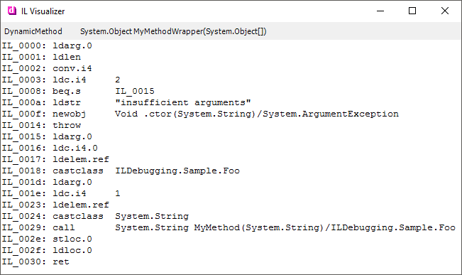
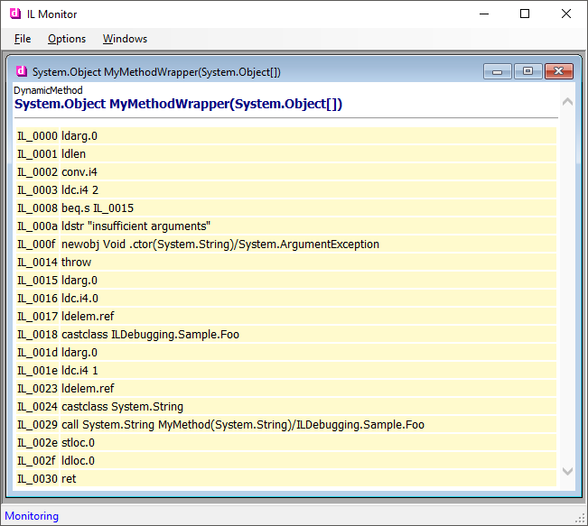

# IL Visualiser

Originally developed by Haibo Luo in 2005 and posted in a series of blog posts 
([part one](https://blogs.msdn.microsoft.com/haibo_luo/2005/10/25/debuggervisualizer-for-dynamicmethod-show-me-the-il/),
[part two](https://blogs.msdn.microsoft.com/haibo_luo/2006/11/16/take-two-il-visualizer/)).

Converted to a Git repository and upgraded to VS2015 by Drew Noakes. Conversion to VS2017 by @dadhi.

## Usage

When paused in the debugger, select an instance of a subclass of `MethodBase` (such as `DynamicMethod`,
`MethodBuilder`, `ConstructorBuilder`, ...) and launch a visualiser:

There are two ways to use this visualiser.

### IL Visualizer (Modal)

Selecting _"IL Visualizer"_ pops up a window showing the IL code.

This window is modal and debugging may only continue once the window is closed.

### Out of Process (Non-modal)

Sometimes you don't want to close the window before continuing your debugging session. For such cases, you 
can run _IL Monitor_ as a separate process, then select _"Send to IL Monitor"_:

IL Monitor is a standalone MDI application that allows displaying mutliple IL views.

## Installation

(Notes apply to VS 2015 and 2017, but are similar for earlier versions)

1. [Download the latest release for your version of Visual Studio](https://github.com/drewnoakes/il-visualizer/releases/latest), or build from source

2. Copy `ILDebugging.Decoder.dll` and `ILDebugging.Visualizer.dll` to one of:

  - `%USERPROFILE%\Documents\Visual Studio 2015\Visualizers`
  - `%USERPROFILE%\Documents\Visual Studio 2017\Visualizers`
  - `VisualStudioInstallPath_\Common7\Packages\Debugger\Visualizers`

3. Restart the debugging session (you don't have to restart Visual Studio)

If you wish to use _Send to IL Monitor_, you run `ILDebugging.Monitor.exe` before attempting to use it from the debugger.

## Earlier Visual Studio Versions

You can target earlier versions of Visual Studio by updating the assembly references for
`Microsoft.VisualStudio.DebuggerVisualizers.dll` to the relevant version.

## License

THE CODE IS PROVIDED "AS IS", WITH NO WARRANTIES INTENDED OR IMPLIED. USE AT YOUR OWN RISK!
